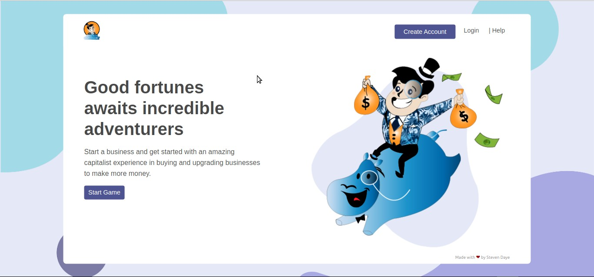

# Adventure Capitalist | Clone Of The Adventure Capitalist Sim-Game
Adventure Capitalist is an idle business sim-game. The basic idea behind the game is to purchase a business, win capital from that business, upgrade the business and then purchase more businesses.

In order to automate this, you can hire a manager who can run the business for you, so you don’t have to click manually anymore. Then you can upgrade the business and gain even more money.

The version of the game implemented here is a clone of the Adventure Capitalist game. So, this is a basic gameplay with upgrading businesses and hiring managers. The game can be accessed online at https://adventure-capitalist-game.herokuapp.com, while the codebase can also be accessed at https://github.com/stevendaye/adventure-capitalist.

## The Problem
The sim-game requires that a user wins capital after purchasing a business. But to gain the capital, he must first click the busines and wait for some time, then he can try again. He must have the choice to choose from many business types. However, to purchase a business, he must have the required capital for the business cost. The action of clicking must be done repeatedly to gain capital. To automate this, the user will have to hire a manager that will automatically perform the clicking action.

To hire a manager, he must have the required capital for that manager. So, in order to have more capital to purchase other businesses and hire more managers, he can upgrade the business to boost the business profit. Likewise, to upgrade a business, he must have the required capital to make such an upgrade. In other word, he must pay for each upgrade and manager he hires, and the cost be automatically deducted from his total capital.

Once the user has managers running a business, the business must continue running on its own while he is away. So, next time he opens the game, it must retrieve back all his previous data and rightly show him the amount of money his business made for him while away. Every capital gained whether present or away must be shown to the user in real-time. Each user must be able to see all his personal activities each time he opens the game; these includes the current capital, business purchases, managers and upgrades.

The main Adventure Capitalist sim-game is based on some Math rules to gain a capital, buy a business, hire managers and buy upgrades. So it will require some understanding on how things work under the hood to implement a clone.

## The Solution
The way we approach the solution will be FULL STACK based. The FULL STACK approach will focus on implementing the sim-game in a microservice way. We will be implementing two microservices: A _**User Authentication Service**_ and a _**Gameplay Service**_.

- *The User Authentication Service(User-Auth-Service)*, will be a standalone backend only server that handles the authentication of every user and remembering their personal data for next time they open the game. Those data will be stored in a MongoDB Atlas database. The service is to know whether the user logged in the game is a new player or has already started a business in the past. It will also handle the saving of the user's capital on browser refresh, tab close, logout and navigation, but also remember the last time he played the game to calculate the time he spent away. It will then pass those data to the **Gameplay Service** which will analyze and make the appropriate offline calculation. The **Gameplay Service** will have access to this service, as it will hold the credentials to authenticate itself successfully to this service. It will not authorize any other service that fails to authenticate itself.

- *The Gameplay Service* on the other side, will be a standalone server that handles both the frontend and backend. It will take care of creating new businesses, managers and upgrades for every authenticated new user. To succeed, it will collect the user's **started_business** attribute(set to **true** or **false**) from the **User-Auth-Service** to determine which actions to execute. In case, the **User-Auth-Service** confirms the user is new and has no business started, the service will then configure the gameplay by creating new businesses, managers and upgrades. Those configurations come from JSON configuration files which are well thought and structured beforehand. They are businesses.json, managers.json and ugrades.json. These are seen like structured tables that pass starting point data to the backend to initialize the game environment for every new user. But, in case the **User-Auth-Service** indicates that it is a registered user that already started a business, the service will then just retrieve all the user'previous activities. Communications between these two microservices will be through an api. Every time the **Gameplay Service** queries the **User-Auth-Service**, it will first have to authenticate itself before accessing any user information. This service will also laverage MongoDB Atlas to persist data. Every data retrieved from the backend will be stored in a Sophisticated State Management System which will be consumed by a View Library that interacts with the user.

- Understanding some of the **Math rules and principles** behind the sim-game is crucial. Therefore, to comprehend how things work under the hood in order to implement a perfect clone, the following ressources will prove to be handy:
   * https://slimmmo.github.io/
   * https://gameanalytics.com/blog/idle-game-mathematics.html
   * https://adventure-capitalist.fandom.com/wiki/AdVenture_Capitalist_Wiki

## Expanding The Solution Data Flow
For better understanding of how things work, the following is how the data flows when the game is opened:

- When the game is opened, a `useEffect()` hook in the **gameplay/client/src/App.js** file will make request against a protected _auth route_ at the **Gameplay backend** service which will in turn make request against the **User-Auth-Service**. Its goal is to get the user's information. It will of course fail if no user is logged in.

 * Now, assuming the user wants to register. At the registration, there will be the user's `started_business` attribute set to `false`. After registration, all the user's information will be sent back to the frontend and stored in the global state. The `useEffect()` hook would then have its result back. Now once the gameplay component is mounted, it checks whether the `started_business` attribute sent from the **User-Auth-Service** is set to `true` or `false`. If it is `false`, then it prepares a new gameplay ennvironement by requesting for pre-configured JSON files that will help initialize the game. Those JSON files are *gameplay/client/src/config/business.json*, *gameplay/client/src/config/mangers.json* and *gameplay/client/src/config/upgrades.json*. It will then send request to the Gamplay Service to create new businesses, managers, and upgrades. While the service is creating new businesses, it will also query the **User-Auth-Service** to set the user's `started_business` attribute now to `true`(because the user has indeed satrted a business).

 * Assuming the user wants to log in. This is supposed that he is already a user. Therefore his `started_business` attribute would have already been set to `true` during his first registration. Once he logs in, the same procedure will restart, just that this time, the gameplay component would receive `true` for the `started_business` attribute for that user. In this case, it will just make request to load all the user's previous activities.

 * Assuming that he hires a manager. Each manager has the type of business he can run and the `id` of the user he belongs to. So, once a manger is hired, the **gameplay/client/src/components/dashboard/managers/Manager.js** component will send a request to the Gamelay backend server to query the `business table` and set the `has_manager` attribute of the concerned business to `true`. Once the result is sent back to the global state, the **gameplay/client/src/components/dashboard/businesses/Business.js** component will re-render and realize that a business has its `has_manager` attribute set to `true`, this will then automatically trigger the automation of capital gain on that business.
  
  * It is good to note that, because the user's capital is automated, we cannot save the capital directly in the backend database every time it increments. This will cause a performace issue. What is rather done, is to keep the incrementation of the capital in the local state, then ervery time the user _*refreshes the app*_, _*closes the app/tab/browser*_, _*logs out*_ or _*navigates away to a different route*_, the capital is automatically saved in the **User-Auth-Service** database through the **Gameplay Service**. We make use of `localStorage` to remember and reset the new capital coming from the backend. The capital stored in `localStorage.capital` is particularly handy when the user "navigates to a different routes and comes back to the application" later.

  * A user that has no manager has no offline report sent to him. But to the user that has a manager for any given business, when he _*refreshes the app*_, *_closes the app/tab/browser*_, _*logs out*_ or _*navigates away to a different route*_, his `last_seen` attribute is automatically saved in the **User-Auth-Service** database. Next time he comes back to the game, the latter service calculates the time he spent away, then sends the result to the **Gameplay Service** which makes the appropriate offline calculation and sends the new gained offline capital to the frontend in the global state. The report is then displayed to the user showing him how much more he gained while away. This is immediately added to his current capital.

  * When the user makes an upgrade, the **gameplay/client/src/components/dashboard/upgrades/Upgrade.json** component makes a request to the Gameplay backend server to apply the upgrade. What it does, is to just remove that ugrade from the list of upgrades in the backend. But at the same time it sends another asynchromous request to the the Business Model to apply the appropriate upgrade to the concerned business. The same mechanism for hiring a manager is used when it comes to removing a manager from the database.

## How To Run The Sim-Game
The sim-game is deployed on heroku and therefore available at https://adventure-capitalist-game.herokuapp.com. However, to run it in local, follow bellow steps.

First make a clone of the project:
- `git clone https://github.com/stevendaye/adventure-capitalist`

Then, in two different terminals, at the root of the project, take each of the following steps in order:
- **User Authentication Service**
    - `cd users/`
    - `npm i`
    - `npm run server`

- **Gameplay Service**
 - Frontend
    - `cd gameplay/client/`
    - `npm i`
 - Backend
    - `cd ../` or `cd gameplay`(if at the root)
    - `npm i`
    - `npm run dev`

NB: Node@v10 or higher is required to run this project successfully. The User-Auth-Service must be kept running in one terminal while the Gameplay Service in another one. Successful run means, not only you must see the port on which each of the services is running but also the sim-game must get start in your favourite browser at http://localhost:3000.

## Getting The Principles And The Math Rules Behind The Sim-Game
### Buying A business
Each business has the following as main attributes:
 - `number_owned`: The total number of a given busines owned by the user
 - `multiplier`: The number of business the user can buy. In our case, it is either 1 or 10
 - `initial_cost`: The initial cost of the business.
 - `next_cost`: The next cost of the business after each purchase.
 - `initial_revenue`: The initial revenue you can gain from the business at each click.
 - `current_revenue`: The revenue you will be making from the business after every purchase.
 - `initial_productivity`: The initial revenue you will gain every second when you have a manager running the business while offline or away.
 - `next_productivity`: The next revenue you will be gaining every second when you have a manager running the business while offline or away.
 - `coefficient`: The coefficient by which is multiplied the `initial_cost` of the business to produce the `next_cost`.
 - `intitial_time`: The time taken to gain a capital after a click.

When a user buys a business, here is what happens under the hood:
 1- The `initial_cost` is multiplied by the `coefficient` to give the `next_cost` of the business.
 2- The `initial_revenue` is multiplied by the `multiplier` and added to the `current_revenue` to give the next `current_revenue`.
 3- The `number_owned` is added to the `multiplier` to give the next `number_owned`.
 4- The `initial_productivity` is multiplied by the `number_owned` to produce the `next_productivity`
 4- The `initial_cost` of the business is finally deducted from the user's **capital**

 `number_owned = number_owned += multiplier`  
 `current_revenue = current_revenue += (initial_revenue * multiplier)`  
 `next_cost = next_cost * coefficient`  
 `next_productivity = initial_productivity * number_owned`

### Upgrading A business
When you upgrade a business, the business profit is boosted three times. Here is what happens under the hood:
 1- The `initial_revenue` is multiplied by 3
 2- The `current_revenue` is multiplied by 3
 3- The `next_cost` is multiplied by 3
 4- The `initial_productivity` is finally multiplied by 3 as well.
 5- The cost of the upgrade is deducted from the user's **capital**.

 `initial_revenue = initial_revenue * 3`  
 `current_revenue = current_revenue * 3`  
 `next_cost = next_cost * 3`  
 `initial_productivity = initial_productivity * 3`

### Hiring A manager
When you hire a manager, it is rather straightforward.
 1- The `current_revenue` is added to the user's **capital** automatically after every `intitial_time`(in seconds)
 2- The cost of the manager is deducted from the user's **capital**.

## Tehchnologies Used For The Sim-Game
### Frontend
- HTML5
- CSS3 & Flexbox
- JavaScript/ES6+
- React.js
- Redux
- Async/Await

### Backend
- Node.js
- Express.js
- Restify.js
- MongoDB Atlas
- JSONWebTokens
- Async/Await

### Architecture
- Model-View-Controller(MVC)
- Microservice
- Unidirectional & Bidirectional Data Flow

### Graphics & Illustrations
- Adobe Illustrator
- Adobe Photoshop

## Reasons Behind Technical Choices & Architecture
- Creating a full stack application was out of passion and more fun, but also for endless possibility to scale the sim-game if additional time was to be given to continue working on game. Seeing the game's complexity, preference went to *React.js*, as our view layer, *Redux* as our state layer and **React Router** to handle our frontend routes. These allowed us to build a performant game application which render very fast and which does not need to make request to the server to serve our routes. They were carefully chosen because they would ease our development and workflow using *Reusable and Composable Compoments*.

- We wanted to have control over the data flow between Services and Views. Having pure components would guarantee us that our data is safe and we can always expect the same output if given the same input. So for this, we chose a Sophisticated State Management System like *Redux* to have an eye on the outcome of our data. Its architecture is based on one way data binding. So this guarantees that our *state* will efficiently be handled with a more predictable state. However we used bidirectional data flow(two way data binding) twice at some stage. We were compelled to do so because we could not lift up state to consume the current capital, but we passed down a function as a `props` to the child component to send the cost to be deducted from the user's current capital.

- *Express.js* as our *Node.js* framework was chosen to help build the backend faster. Relying on only pure *Node.js* would have made us code more in a low-level environment and consume more time. However, *Restify.js* was especially used for the **User-Auth-Service** because, this service was to serve as a scalable RESTfull Web Server where we will need to expose an api to make request against different kind of http routes. So, since **Restify.js** is optimized for building semantically correct RESTfull web services ready for production use a scale, we think we made the best choice for using this framework for the User Microservice.

- The sim-gane laverages *MongoDB Atlas* to persist data in both microservice. Initially, the sim-game was built with **SQLite3** and **Sequelize**. These were chosen because it would help us build our application faster without the need to depend on a database server everytime we are runnig the sim-game. Moreover, a database server, would cost us time and money when we are to deploy it on a Cloud Hosting Platform which requires credit card and additional configurations. After deploying to heroku, we realized that our sqlite3 database file was being cleaned up everytime the **dyno** reboots. This is because the Heroku filesysten is **ephemeral**, thus causing us to loose all previous stored data. Therefore, we quickly switched to **MongoDB Atlas**, which actually turned out to be a great fit for our goal: _**Security**_ and _**Scalability**_.

- The decision to develop the sim-game in a **microservice** way was taken due to the fact that, we thought from day 1, to make the application scalable, secured and more maintainable. Using microservices, we can focus on each little part of our application, making it more modular, robust while being able to debug it easily in case of any unexpected behaviour. Talking of scalability and security, it would be easy for us to dockerize the application later to add more level of security and scale it as we would wish by laveraging Docker tools.

- Adobe Illustrator was used to draw all art illustrations, and Adobe Photoshop was used to refine some illustrations by sharpening them to give it a photo feel. This is to make the design of the sim-game more attractive, interactive and more fun to use. Also, since this is a clone, the goal was to make it close enough to the original sim-game while giving it a personal modern touch.

## Sim-Game Technical Structure & Organisation
At the root of the project, we have our two microservices in two diffrent directories: **users** and **gameplay** directories.

### "users" Directory
Under this directory are the files needed to build and run the (backend only) User Authentication Service. This service is securely also hosted on _Heroku_ at https://adventure-capitalist-users.herokuapp.com. Originally, the service was to be deployed on _Netlify_. But following the **Twelve Factor App Rules** that suggest not to rely on anything external that could rather be located on the same server, our mind was changed to host it with the same Cloud Hosting Provider(CHP). If the User-Auth-Service was hosted on a different CHP like _Netlify_, our sim-game which is hosted on _Heroku_ would take a big hit if _Netlify_ should be down or slowed for any reason(financial reason for example, since we will be using a free plan).

Now, the following are what caontains the *user directory* and the role they each play:
 - The _**server.js**_ file holds the logic to create and secure the User-Auth-Service.

 - The _**config**_ directory holds a **default.json** file which gathers all the user service routes in one place, and a **db.js** file which configures and starts The *User-Auth-Service* **MongoDB Atlas** database. The json file, allows us to have a single source of truth for all our http routes, in order to avoid typos and repetitions.

 - The _**routes**_ , _**controllers**_ and _**models**_ directories hold each a singe file to respectively handle routes, request and perform actions such as **create user**, **find user by id**, **find user by email**, **check user's password**, **update user's business status**, **save user's last seen** and **get user's away time**. The "list all users" and "destroy user" queries are handled but not made availble to the end user.

 - The _**scripts**_ directory contains 4 files that test our User-Auth-Service using the **Restify-Client** library. Before an end-to-end test with Postman, we first wrote those scripts to test the creation, reading, deletion and listing of users.

### "gameplay" Directory
Under this directory are the files needed to build and run the Gameplay Service. The service itself is divided into two folds: The **Gameplay Frontend** and the **Gameplay Backend**.

#### Gameplay Backend 
The gameplay backend has all its files at the root of this directory exept for the _**client**_ directory. This backend is responsible for preparing the game environment for any authenticated user. It communicates with the **User-Auth-Service** to determine whether to create new businessees, managers and upgrades or to just retrieve old data. Its structure and technical choices are still quite the same as with the **User-Auth-Service**.

 - The **app.js** file holds the logic to create the gameplay backend server

 - The _**config**_ directory here, also holds a **default.json** file which gathers all the gameplay service routes in one place, and a **db.js** file which configures and starts the *Gameplay Service* **MongoDB Atlas** database.
 
 - The _**routes**_ directory holds 5 files that handles each the gameplay routes for different actions requested by the user.
    * **auth.js** handles the route for authenticating the user.
    * **users.js** handles the routes for registering and login the user, saving the user's capital and his last seen.
    * **businesses.js** handles protected routes for creating and buying businesses, putting a manager, applying a business upgrade, getting offline report and listing all type of businesses.
    * **managers.js** handles protected routes to create, hire and list managers.
    * **upgrade.js** handles protected routes to create upgrades, upgrade businesses and get the list of all upgrades.

 - The _**controllers**_ directory holds logics that query the _**models**_ directory to perform actions in the MongoDB Atlas database, to handle each request that comes from each route, namely the creation of businesses, managers, upgrades, the purchase of businesses, the upgrade of businesses, the hiring of a managers etc...

 - The _**middleware.js**_ directory holds middleware files like the _**errorHandler.js**_, _**logs.js**_ and _**utilities.js**_ that respectively hanlde errors and not found requests, http request logging with Morgan and jsonWebToken verification.

It is important to note that, the logic for the **Gameplay Service** to communicate with the **User-Auth-Service** is handled by the _**users-superagent.js**_ file in the **models** directory. It lavarages the **Superagent Library** to send request to the remote user server(User-Auth-Service).

#### Gameplay Frontend
The _**client**_ directory is where lays our frontend. It laverages React as our View Layer and Redux as our State Layer. All our logic is found in the _**src**_ directory. There we have:

 - _**App.js**_ and _**index.js**_ respectively makes the Redux Store available for the whole application and render our views.

 - React is all about components. They are re-usable and composable. So the _**components**_ directoy handles all our React components to display views to the user. They are structured the following way:

    * The _**auth**_ directory holds form components to handle Login and Registration

    * The _**layout**_ directory holds components that take care of the sim-game layout and design. They include, the Navabar, Footer, Notifications, 404, Spinner and Landing pages.

    * The _**Routes**_ diretory handles components for all our frontend routes.

    * The _**Dashboard**_ directory is where seats all our game. It includes components such as _**Features.js**_ to show the managers and upgrades feature buttons, _**Help.js**_ to show a screen that explains to the user how to play the game, the _**Report.js**_ to show a screen reporting to users who have managers the amount of money they made while away, the _**UXHelper.js**_ to handle a mini interactive tutorial with the user to show him how to get started with the game, and the _**Gameplay.js**_ screen that is main Parent component that makes request to create businesses, managers and upgrades while passing important states and handlers to Businesses, Mamagers and Upgrdes components. It is the one reponsible for Updating the capital through incrementation and deduction.

    * The _**buinsesses**_ directory has two main components: **Businesses.js** that retrieves the list of businesses and map each of them to the **Business** component which in turn handles the logic to **buy a business**, **apply a business upgrade**, **put or delegate a manager to a business**.

    * The _**managers**_ directory has two main components as well: **Managers.js** that retrieves the list of managers and then map each of them to the **Manager.js** component which in turn handles the logic of **hiring a manager**, **displaying his information** and **sending events for automating capital gains**. Each manager has a business type that he can run. Once hired, the backend is notified and set the "has_manager" attribute of the related buinsess to true. This is in turn stored in the store which updates the state. The view re-rendered to automate capital gained from that business while also removing that manager from the list.

    * The _**upgrades**_ directory has two main components just like the managers and upgrades components. **Upgrades.js** makes request to the backend to retrieve as well the list of upgrades and map each of them to the **Upgrade.js** which in turn handles the logic for **upgrading a business**. Each upgrade has the type of business it can affect. Once a business upgrades, the gameplay backend is notified and tripple the business benefit. The store is then updated, and the view is re-rendered to show the new upgrades, while removing the upgrade from the list.

 - The _**actions**_ directory holds files for different actions creators used for any request made from the view to the gameplay backend server. These action creators emits events upon any business, manager or upgrade activity.

 - _**reducers**_ directory holds files that listen to each events emitted by action creators to update the global state

 - _**store**_ directory holds a single file that create the global state that will be used by any component in the sim-game

 - _**thunks**_ directory holds redux-thunk files that handle the logic to make asynchronous request to the backend server triggered by the user for any activity happening in the gameplay.

 - _**constants**_ directory holds a single file that serves as our single source of truth for all action types used by action creators and reducers.

 - _**config**_ directory handles the configuration files needed to initialise our game. They are *business.json*, *mangers.json* and *upgrades.json*.

 - _**apis**_ directory holds all our api routes to make request to the backend server. They are called by the _**thunks**_ directory files for any asynchronous request.

 - _**utils**_ directory holds a single file that makes sure the **Token** of the authenticated user is sent back to axios to allow requests against protected routes in the gamepaly backend.

 - _**assets**_, as the name indicates, this directory handles all our public files. They are fonts, gaphics and background tones.

## State Of The Sim-Game Features
All features have been delivered. They include:
 - Buy a business
 - Upgrade a business
 - Gain money after a click
 - Hire Managers
 - Automation of capital gain after a manager is hired
 - The implementation of several business types to choose from
 - Report to the user next time he opens the game, the amount he made while away

## Trade-offs
Although all features have been delivered. There are some things that need to be notified. Priority was set to give the best experience possible to users. So after completing the above features, we endeavoured to help the user understand and play with fun the game by adding a _**help**_ page, a fun _**mini-tutorial**_ on how to get started with the game through illustrations and a _**loading bar**_ to help the user know that he clicked a business and that the capital he gained was loading. So, while putting focus on these, we couldn't have the time to format the time of each business properly. So beside each business type, instead of the proper format `00:00:03` for example, it was displayed `0:0:3`. Neither could we properly format the capital to display for example `25.127 Billion` instead of `25,127,345,789`.

On the other hand, the sim-game has been tested successfully on all major browsers except for Safari. However, there is an unwanted behaviour with Firefox when displaying the list of Managers and Upgrades. Because the scroll bar was hidden for design sake, but still allow scrolling, Firefox seems to not show all the list of Managers and Upgrades but leaves out each of the last two. While trying to solve this, other browsers were affected. Since it is the only browser that behaves like this, we prefered to concentrate our effort on making things work seamlessly on all other major browsers.

## What May Have Been Done If Given Additional Time On The Project
If given additional time on the project, we would start by fixing the above time and capital format. Apart from this, there are things we would like to do differently but also add. They are:
 
 - _**Deploy the application on DigiatOcean(DO)**_: We would have prefered to deploy the sim-game on DO. This is a great Cloud Hosting Platform which will give us the tools needed to esily scale our game. So, buying a domain name and setting SSL Security to encrypt the link between the client and the server will be a great start to give our sim game an official look that can be trusted by the audience.

 - _**Use of TypeScript instead of JavaScript/ES6**_: It was really interesting using ES6+. But it has its limits. For the reason that JavaScript is not a typed language, it can be buggy to use it on very large projects. Moreover, we were using _**PropTypes**_ in React to check the type of data we are expecting. Still, it does not really help since it does not enforce the type of data we want but makes it pass with just a warning in case it sees a different type. Meanwhile, Using *TypeScript* would have made things much safer, giving us the ability to laverage its features to build a product that scales better.

 - _**Dokerize the sim-game**_:  Using Docker in our sim-game would make it more robust and secured. For games that must be used by a very large audience, we must think in terms of scalability and security. With Docker, instead of having two mocroservices, we would rather have 2 networks with 4 microservices. The *AuthNet* that handles 1 microservice running the **User-Auth-Service** and 1 microservice running its database, and the *FrontNet* that handles 1 microservice running the **Gameplay Service(backend)** and 1 microservice running its database. For the two databases, we will be using MySQL Docker Images. As for the 2 networks, they will be comminicating through a Docker Bridge Network, all secured.

- _**Add additional features**_: It would be interesting to work on additional features of the Adventure Capitalist sim-game. Adding more **Cash Upgrades**, **Angels Upgrades**, **Gold Upgrades**, **Managers** and **Investors** would be very fun. However these are some personal features that we think we can bring in the sim-game:
   * _*List the top 25 users/palyers and their capital in real time*_: It would be fun to introduce a new feature that would allow users to see the progress of the top 25 players. Every user will be able to see the capital of those top 25 in real time. From there, any user can request for a trade in orther to exchange something to have more money added to his own capital.
   * _*Invest money in stock exchange*_: It would add more fun if we can introduce another feature that would allow users to invest some of their capital into stock exchange. This will help them gain more capital if what they invested in raises, but make them loose money if it drops.

- _**Develop a mobile bersion of the sim-game**_: Currently, the sim-game can only be played on large screens. In other to make it more user-friendly, we would like to develop a mobile version of the game. This will then be made responsive to be played on all sorts of screens. The way the sim-game was developed is in such a manner that if we were to work on it later, it would be easy and straightforward. That's the very reason why we used **Flexbox** in the first place.

- _**Write unit and integration tests for the application**_: In every software development lifecycle, tests are written to ensure the application behaves the way we expect and spot bugs at very early stage. Some end-to-end API tests were covered with Postman for the sim-game. But it is safer and best practice to write unit and integration tests that cover the whole application. So we would start testing all our components with *JEST*, then some functionalities with *Enzyme*. We would use *Mocha* to test our controllers and models in the backend. If given time, we would also love to automate our tests with *Puppeteer*.

- _**Make animations and give the art illustrations a better look**_: The illustrations drawn are fine. But it may be missing more professional touch to be of very high quality. It would be greater to make it look more like the ones we see on the **Game Closure** website. They are neater, and very catchy. Also, why not give it a 3D feel and make some animations as we would see in games?
